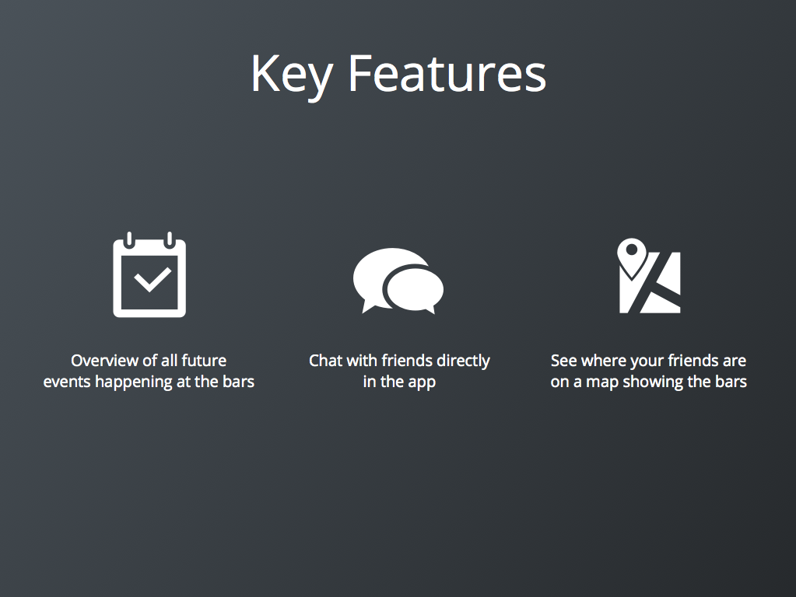
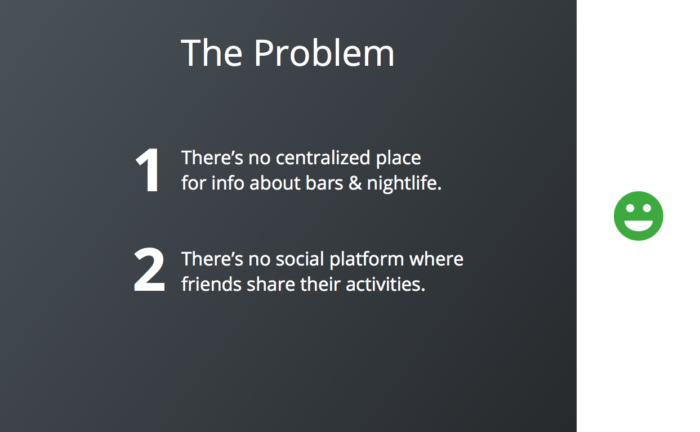

#Slide Design for Non-Designers - The Basics

We've all faced the same situation. A presentation or pitch is due the following day and it’s now just a matter of *vomiting content* onto some horrendous PowerPoint template and getting the head straight and notes right. Shit.

On top of this, we're not all designers, not everyone has that eye for the aesthetically pleasing. Most of what it takes to make a deck stand out can be learned and practiced - but not in an hour. 
That’s why a lot of decks end up being extremely cluttered, text-heavy, far from legible and less than understandable.

**Let’s go through a few quick guidelines for keeping the quality up when creating slides:**

####Have the use case in mind
Is it intended as an investor deck, a pitch deck, to print as pdf, or a fourth thing? Know it. It’s important for how it should look, what it should contain, and how you export it. Resolution, font size, format, file size, ratio, etc. Should the slides supplement you and your pitch? Or should they be self-explanatory?
An investor deck made for the purpose of being sent to investors would contain a lot more text - where as a pitch deck should be a supplement to what you're saying.   

####Have a clear message
What is the purpose of this slide? What is it I want to tell with this? Ask yourself those questions with every single slide. If you can't answer those questions, delete/skip the slide.

####Keep a hierarchy!
What is headlines, what is body text, what is bold, coloured, or made to stand out. Keeping a hierarchy and keeping it consistently makes the viewer less confused and forces you to be more organized.

####Be consistent!
If your headline on slide 1 is black, size 48, aligned left, and in lower case. What do you think your headline on slide 2 should look like? 

The exact same, right.

**Notice** the headline font, size, and position, and the body text size and position. 
Consistency is also vital when it comes to shape and size of icons and images, and the colors scheme. 

####Show it!
Symbols, pictures, icons, shapes, graphs, charts, arrows, colours. Text is rarely visually appealing. Imagery helps the appeal but also the understanding when it comes to explaining one or more points in one slide - even if it's really simple.
There's a bunch of great sites out there for icons. Check out [The Noun Project](https://thenounproject.com) and [Flaticon](http://flaticon.com).

####Keep it simple!
You've heard it a thousand times - probably because it’s true. **Less is more.**
The lesser the words the more they stand out. Don't use a wall of text to explain a point if two sentences can do the same. Of course this depends on the use case of the slide deck.

####Use plenty of white space!
White space, also known as negative space, gives the elements room to breathe. Using white space makes the elements stand out and stand stronger, and makes the slide appear less cluttered and more elegant. Just because we call it white space, it doesn't mean that it has to be white, it just means that it should be free of text, images, and other elements. 

Like with the examples of slides you saw above - as soon as the content is either cut down to bare minimum or distributed across the slide in a careful way, the content stands out a lot stronger and everything looks a lot more pleasant.  

####Forget the transitions & effects!
Most of the built in *explode-from-gold-dust-and-rotate-counter-clockwise-with-big-swoosh* effects and *dissolve-slowly-but-muddy-into-the-next-slide* transitions are, let’s face it, ugly, outdated, and doesn't add any value to your content. 
Only at the point where all slides are designed well and with consistency, does it become interesting to focus on adding those small extra details that makes it perfect. Those small details can be in the form a subtle animation of a part of the content being pulled on to the next slide or a table expanding while new content is added.   

####Test it! 
Who are the customers? Students? Partners? Investors? You think that **you** assuming they will understand a chart is enough? Let me break it for you - it isn’t. Test it, ask someone from your target group, get advice. 

####Closing remarks
I hope that these guidelines can help next time you're creating a slide deck. It doesn't take much to remember them and in a matter of minutes they will make you look more organized, more professional, and make everything easier to read and understand for your target group. 

As always, I'm open for comments and critique. 